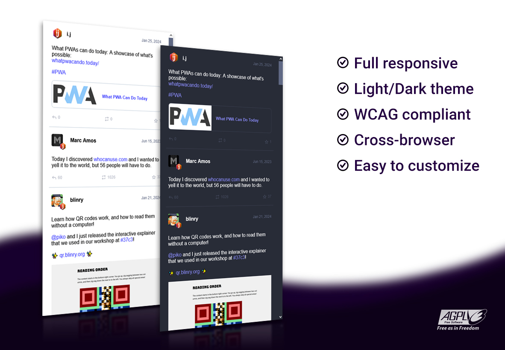

# 🐘 Mastodon embed timeline

Embed a Mastodon timeline in your page with just a CSS and JS file.

Demo:  
<https://codepen.io/ipuntoj/pen/MWppNGL>

## 📋 Table of contents

- [Installation](#-installation)
- [Setup](#-setup)
- [API](#-api)
- [Examples](#-examples)
- [Browser support](#-browser-support)
- [Improve me](#-improve-me)
- [License](#️-license)
- [FAQ](#-faq)
- [Alternatives](#alternatives)

## 🛠️ Installation

Steps for installing the timeline in three different ways. [Click here](https://gitlab.com/idotj/mastodon-embed-timeline/-/blob/master/docs/INSTALLATION.md)

## ⚙️ Setup

Steps to configure and customize your timeline. [Click here](https://gitlab.com/idotj/mastodon-embed-timeline/-/blob/master/docs/SETUP.md)

## 🔌 API

The current version has the following functions that can be performed:

| Function                  | Description                                                                     |
| ------------------------- | ------------------------------------------------------------------------------- |
| `mtColorTheme(themeType)` | Apply a theme color. `themeType` accepts only two values: `'light'` or `'dark'` |
| `mtUpdate()`              | Reload the timeline by fetching the lastest posts                               |

## 📚 Examples

The folder `examples/` contains different demos of timeline types to play with. Download the full project and open each HTML file in your favorite browser.  

If you have any problems loading the examples in your browser (e.g. CORS error), check the documentation [CONTRIBUTING.md](https://gitlab.com/idotj/mastodon-embed-timeline/-/blob/master/CONTRIBUTING.md#testing) to run the examples using alternatives such as Docker or Http-server.

## 🌐 Browser support

Mastodon embed timeline is supported on the latest versions of the following browsers:

- Chrome
- Firefox
- Edge
- Safari
- Vivaldi
- Opera

## 🚀 Improve me

Feel free to add your features and improvements.  
The [CONTRIBUTING.md](https://gitlab.com/idotj/mastodon-embed-timeline/-/blob/master/CONTRIBUTING.md) document to learn more about how to modify, build and collaborate on the project.

## ⚖️ License

GNU Affero General Public License v3.0

## 💬 FAQ

Check the [closed issues](https://gitlab.com/idotj/mastodon-embed-timeline/-/issues/?sort=created_date&state=closed&first_page_size=20), you might find your question there.

If nothing matches with your problem, check the [open issues](https://gitlab.com/idotj/mastodon-embed-timeline/-/issues/?sort=created_date&state=opened&first_page_size=20) or feel free to create a new one.

Looking for a previous version of Mastodon embed timeline?  
Check on the tags list to see all the released versions: [Tags history](https://gitlab.com/idotj/mastodon-embed-timeline/-/tags)

## Alternatives

Other projects to embed your Mastodon timeline:

- <https://gitlab.com/clvgt12/mastodon-embed-feed-timeline> (fork of this project)
- <https://github.com/sampsyo/emfed>
- <https://mastofeed.com>
- <https://github.com/SamTherapy/fedifeed> (fork of mastofeed)
- <https://github.com/DomainDrivenArchitecture/dda-masto-embed>
- <https://github.com/DyosTheNerd/MastodonIFrameEmbed>
