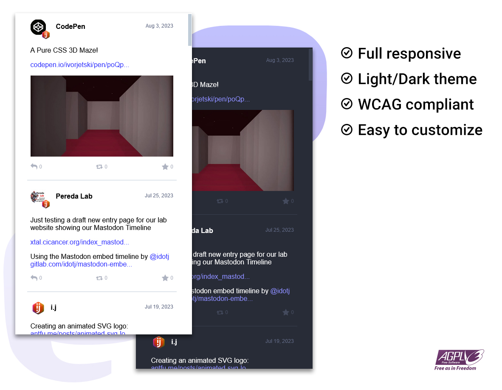

# 🐘 Mastodon embed timeline



Embed a mastodon feed timeline in your page, only with a CSS and JS file.

Working version running at:
<https://www.idotj.com>

Source code running at:
<https://codepen.io/ipuntoj/pen/MWppNGL>

## 🗂️ User guide

Just copy both files (*mastodon-timeline.css* and *mastodon-timeline.js* from /src folder) in your project folder.

Now call each one in your page using the `<link>` and `<script>` tag:

```html
<link rel="stylesheet" href="mastodon-timeline.css">
```

```html
<script src='mastodon-timeline.js'></script>
```

Then copy the following html structure:

```html
<div class="mt-timeline">
    <div id="mt-body" class="mt-body" role="feed">
        <div class="loading-spinner"></div>
    </div>
</div>
```

Great, you have a Mastodon timeline running in your page.

The next step will be to setup the timeline.  
Edit the the JS file *mastodon-timeline.js* and at the beginning find these two lines:

```javascript
    instance_url:   'Your Mastodon instance',
    timeline_type:  'local',
```

Enter your Mastodon instance URL (not including the last `/` symbol) and reload the page. You should see toots from your local instance in your timeline.

If you want to show a profile timeline then change the `timeline_type` to `profile` and set the following values:

```javascript
    user_id:        'Your user ID on Mastodon instance',
    profile_name:   'Your user name on Mastodon instance',
```

If you prefer to show a timeline with a specific hashtag then change the `timeline_type` to `hashtag` and enter the name of the hashtag (not including the `#` symbol):

```javascript
    hashtag_name:   'YourHashtag',
```

Also you have some parameters to customize your embed timeline:

```javascript
    // Preferred color theme 'light' or 'dark' (default: auto)
    default_theme: 'auto'

    // Maximum amount of toots to get (default: 20)
    toots_limit: '20'

    // Hide boosted toots (default: don't hide)
    hide_reblog: false

    // Hide replies toots (default: don't hide)
    hide_replies: false

    // Limit the text content to a maximum number of lines (default: unlimited)
    text_max_lines: '0'

    // Customize the text of the link pointing to the Mastodon page (appears after the last toot)
    btn_see_more: 'See more posts at Mastodon'

```

### Tip

If you don't know your `user_id`, you have two ways to get it:

- Right click on your avatar image and inspect the element.  
You will see in your html code a line like this one:  
``  
Check the `src=""` url, your user id is between `/accounts/avatars/` and `/original/`. So removing the slashs `/` you will get your user id, like in the example: `000180745`

- Other option, just copy your profile name and instance uri here:  
<a href="https://prouser123.me/mastodon-userid-lookup/" target="_blank" rel="noopener">https://prouser123.me/mastodon-userid-lookup/</a>

## 🚀 Improve me

Feel free to add/improve the styles and add more features.

## ⚖️ License

GNU Affero General Public License v3.0
